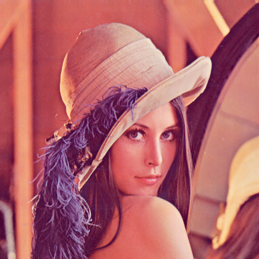
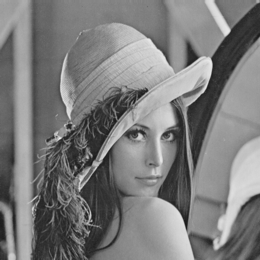
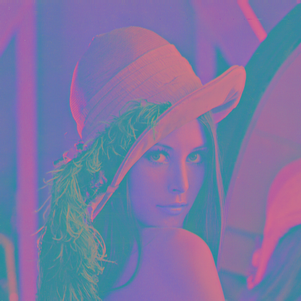
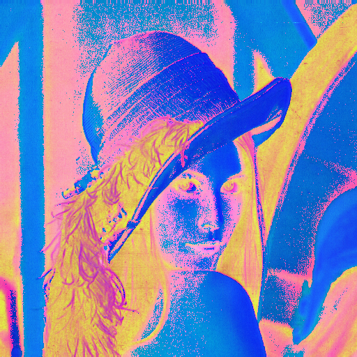

# MATLAB Week 2 Classroom Session: Image Processing Tasks

This README summarizes the activities and learning outcomes from the MATLAB classroom session in Week 2. The session focused on image processing techniques using MATLAB, covering image visualization, manipulation, color space conversions, and analysis. Below is a detailed overview of what happened in the classroom, including the tasks performed and the key functions used.

## Overview of the Session
In this session, students worked on three main tasks related to image processing:
1. **Task 1: Image Visualization** - Loading, displaying, and comparing images.
2. **Task 2: Image Manipulation** - Analyzing image properties, extracting color channels, converting to grayscale, and performing pixel intensity analysis.
3. **Task 3: Case Study Analysis** - Converting color spaces (RGB to YCbCr and HSV), visualization, and checking reversibility.

The session emphasized hands-on coding with MATLAB's Image Processing Toolbox, demonstrating practical applications in surveillance and image analysis.

## Task 1: Image Visualization
This task introduced basic image loading and display operations. Students learned to read images from files, display them in figures, compare multiple images, and save processed images.

### Key Activities:
- Loaded two images: 'lena-Colour.png' and 'cameraman.tif'.
- Displayed each image individually using imshow.
- Created a montage comparison of both images.
- Saved the first image to the output directory.

### Functions Used:
- `imread(filename)`: Reads an image from a file into a matrix. Supports various formats like PNG and TIF.
- `imshow(image)`: Displays an image in a MATLAB figure window.
- `imshowpair(image1, image2, 'montage')`: Displays two images side by side in a montage for comparison.
- `imwrite(image, filename)`: Writes an image matrix to a file.

## Task 2: Image Manipulation
This task delved deeper into image properties and manipulation techniques. Students analyzed image matrix dimensions, extracted individual color channels, converted images to grayscale, and examined pixel intensities.

### Key Activities:
- Loaded and displayed the same two images as in Task 1.
- Determined the size (dimensions) of each image matrix.
- Extracted Red, Green, and Blue channels from the color image and displayed them in a montage.
- Converted the color image to grayscale and analyzed its properties.
- Performed pixel intensity analysis on the Red channel, finding maximum and minimum values.

### Functions Used:
- `size(matrix)`: Returns the dimensions of a matrix (rows, columns, channels).
- `disp(text)`: Displays text or variables in the command window.
- `num2str(number)`: Converts a number to a string for display purposes.
- `montage(images)`: Displays multiple images in a single figure as a montage.
- `im2gray(image)`: Converts a color image to grayscale by averaging color channels.
- `max(array)` and `min(array)`: Find the maximum and minimum values in an array (used with (:) to flatten the matrix).

## Task 3: Case Study Analysis
This task focused on color space conversions and their applications in surveillance scenarios. Students converted images between RGB, YCbCr, and HSV color spaces, visualized the results, and verified reversibility.

### Key Activities:
- Loaded the images again.
- Converted the color image from RGB to YCbCr and HSV color spaces.
- Visualized the converted images and compared them to the original.
- Extracted and displayed the Luminance (Y) channel from YCbCr and Hue (H) channel from HSV.
- Checked reversibility by converting back from YCbCr to RGB and comparing with the original.
- Saved all processed images to the output directory.

### Functions Used:
- `rgb2ycbcr(image)`: Converts an RGB image to YCbCr color space, separating luminance from chrominance.
- `rgb2hsv(image)`: Converts an RGB image to HSV (Hue, Saturation, Value) color space.
- `colorbar`: Adds a color bar to the current figure for visualizing intensity ranges.
- `subplot(rows, cols, index)`: Creates subplots in a figure for displaying multiple images.
- `ycbcr2rgb(image)`: Converts a YCbCr image back to RGB color space.

## General MATLAB Concepts Used
Throughout the session, students also used basic MATLAB commands for figure management and navigation:
- `figure`: Creates a new figure window.
- `title(string)`: Adds a title to the current figure or subplot.
- `cd(path)`: Changes the current working directory.
- `imwrite(image, filename)`: (Repeated from Task 1) Used to save images.

## Learning Outcomes
By the end of the session, students gained practical experience with:
- Image I/O operations (reading and writing).
- Basic image display and comparison techniques.
- Understanding image matrix structures and properties.
- Color channel manipulation and grayscale conversion.
- Color space conversions and their applications.
- Pixel-level analysis for intensity values.

All output images were saved in the `Classroom/Output/` directory for reference.

## Files in This Directory
- [Task1_Image_visualization.m](Task1_Image_visualization.m): Script for Task 1.
- [Task2_Image_manpaluation.m](Task2_Image_manpaluation.m): Script for Task 2 (note: filename has a typo, should be "manipulation").
- [Task3_CaseStudy_Analysis.m](Task3_CaseStudy_Analysis.m): Script for Task 3.
- `Output/`: Directory containing saved images from all tasks:
  - [lena-Colour.png](Output/lena-Colour.png): Copy of the original color image (saved in Task 1 for reference).
  - [lena-Gray.png](Output/lena-Gray.png): Grayscale conversion of the original color image (from Task 2, reducing to single channel).
  - [lena-YCbCr.png](Output/lena-YCbCr.png): Image converted from RGB to YCbCr color space (from Task 3, separating luminance and chrominance).
  - [lena-HSV.png](Output/lena-HSV.png): Image converted from RGB to HSV color space (from Task 3, representing hue, saturation, and value).
  - [lena-Reconstructed-YCbCr.png](Output/lena-Reconstructed-YCbCr.png): Image reconstructed back to RGB from YCbCr (from Task 3, demonstrating reversibility).
- [README.md](README.md): This summary file.

## Image References
The following images were used in the tasks and are located in the `Asset/` directory:
- `Asset\lena-Colour.png`: A standard color test image of Lena Söderberg, widely used in image processing research and demonstrations.
- `Asset\cameraman.tif`: A grayscale test image featuring a cameraman, commonly used for image processing examples and tutorials.

These images serve as sample data for demonstrating various image processing techniques.

## Sample Images
Here are some sample images used and generated during the tasks:

### Input Images

*Original color image of Lena used in Tasks 1-3.*

*Grayscale cameraman image used in Tasks 1-2.*

### Processed Images

*Grayscale version of Lena (from Task 2).*

*Lena converted to YCbCr color space (from Task 3).*

*Lena converted to HSV color space (from Task 3).*

*Lena reconstructed back to RGB from YCbCr (from Task 3).*

For more details on any specific function, refer to MATLAB's documentation or the Image Processing Toolbox help.