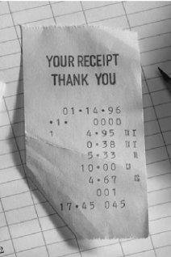

# Task 2: Image Brightness Adjustment

This task demonstrates how to load RGB images, apply local brightness enhancement, save the adjusted images, and display both original and adjusted versions using MATLAB.

## Images Used

### Original Images
These are the input images loaded from the Asset folder:

  
*Original First Image (rec1.PNG)*

  
*Original Second Image (rec2.PNG)*

### Adjusted Images
These are the output images after brightness enhancement, saved to the Output folder:

  
*Brightness Enhanced First Image (FirstImgAdjustedRGB.png)*

  
*Brightness Enhanced Second Image (SecondImgAdjustedRGB.png)*

The adjusted images show improved brightness in darker areas compared to the originals.

## Code Description

The MATLAB script `Ch1_Adjusting_img.m` performs the following steps:

1. Sets the project directory to the Uni folder.
2. Changes the current working directory to the project folder.
3. Loads two RGB images: `rec1.PNG` and `rec2.PNG` from the Asset folder.
4. Converts both images to grayscale (though grayscale versions are not used further in this script).
5. Applies local brightness enhancement to both RGB images using `imlocalbrighten` with a factor of 0.5 to brighten darker areas.
6. Saves the adjusted RGB images to the Output folder as PNG files.
7. Displays the original and adjusted images in a 2x2 grid for comparison.

## Functions Used

The script uses the following MATLAB functions:

- `cd(path)`: Changes the current working directory to the specified path, ensuring the script runs from the correct folder.
- `imread(filename)`: Reads an image file into a matrix that MATLAB can process.
- `rgb2gray(rgb)`: Converts a color (RGB) image to a grayscale image by removing color information and keeping only intensity values.
- `imlocalbrighten(I, amount)`: Enhances the brightness in darker areas of an RGB image by the specified amount (0.5 in this case).
- `imwrite(I, filename)`: Writes an image matrix to a file in the specified format (PNG here).
- `figure(Name, value)`: Creates a new figure window with a custom name for displaying plots or images.
- `subplot(m,n,p)`: Divides the figure into a grid (m rows, n columns) and selects the p-th subplot for the next plot.
- `imshow(I)`: Displays an image matrix in the current axes.
- `title(str)`: Adds a title to the current plot or image display.

## Purpose

This task illustrates how to improve image visibility by enhancing brightness in underexposed areas, which is useful for image preprocessing in computer vision applications.

## Running the Script

To run this script in MATLAB:

1. Open MATLAB.
2. Navigate to the Task_2 folder.
3. Run `Ch1_Adjusting_img.m`.

The script will display a figure window showing the original and adjusted images in a 2x2 grid and save the adjusted images to the Output folder.