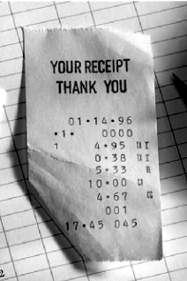

# Task 3: Comparing All Images (RGB and Grayscale Adjustments)

This task demonstrates loading RGB images, converting them to grayscale, applying brightness enhancement to RGB images, applying contrast adjustment to grayscale images, saving all adjusted images, and displaying comparisons using MATLAB.

## Images Used

### Original Images
These are the input RGB images loaded from the Asset folder:

  
*Original First Image (rec1.PNG)*

  
*Original Second Image (rec2.PNG)*

### Adjusted RGB Images
These are the RGB images after brightness enhancement, saved to the Output folder:

  
*Brightness Enhanced First RGB Image (FirstImgAdjustedRGB.png)*

  
*Brightness Enhanced Second RGB Image (SecondImgAdjustedRGB.png)*

### Adjusted Grayscale Images
These are the grayscale versions after contrast adjustment, saved to the Output folder:

  
*Contrast Enhanced First Grayscale Image (FirstImgAdjustedGray.png)*

  
*Contrast Enhanced Second Grayscale Image (SecondImgAdjustedGray.png)*

The adjusted images show improvements: brightness enhancement for RGB and contrast stretching for grayscale, making details more visible compared to the originals.

## Image Comparison

To help identify and compare the images:

- **Original Images**: These are the unaltered RGB images loaded from the Asset folder. They serve as the baseline for comparison.
- **Adjusted RGB Images**: These are the RGB images after applying local brightness enhancement. Notice how darker areas appear brighter, improving visibility without losing color information.
- **Adjusted Grayscale Images**: These are the grayscale versions after contrast adjustment. The intensity range is stretched, making the image appear with better contrast (darker areas become darker, lighter areas become lighter).

For a side-by-side visual comparison, the script displays the originals and adjusted images in figure windows. The RGB adjustments enhance brightness in low-light areas, while the grayscale adjustments improve overall contrast for better detail visibility.

## Code Description

The MATLAB script `Ch_1_Comparing_all_images.m` performs the following steps:

1. Sets the project directory to the Uni folder.
2. Changes the current working directory to the project folder.
3. Loads two RGB images: `rec1.PNG` and `rec2.PNG` from the Asset folder.
4. Converts both images to grayscale for further processing.
5. Applies local brightness enhancement to the RGB images using `imlocalbrighten` with a factor of 0.5.
6. Saves the adjusted RGB images to the Output folder as PNG files.
7. Displays the original and adjusted RGB images in a 2x2 grid for comparison.
8. Applies contrast adjustment to the grayscale images using `imadjust` to stretch intensity values.
9. Saves the adjusted grayscale images to the Output folder as PNG files.
10. Displays the original RGB images alongside the adjusted grayscale images in a 2x2 grid to compare different adjustments.

## Functions Used

The script uses the following MATLAB functions:

- `cd(path)`: Changes the current working directory to the specified path, ensuring the script runs from the correct folder.
- `imread(filename)`: Reads an image file into a matrix that MATLAB can process.
- `rgb2gray(rgb)`: Converts a color (RGB) image to a grayscale image by removing color information and keeping only intensity values.
- `imlocalbrighten(I, amount)`: Enhances the brightness in darker areas of an RGB image by the specified amount (0.5 in this case).
- `imadjust(I)`: Adjusts the contrast of a grayscale image by stretching the intensity range to improve visibility.
- `imwrite(I, filename)`: Writes an image matrix to a file in the specified format (PNG here).
- `figure(Name, value)`: Creates a new figure window with a custom name for displaying plots or images.
- `subplot(m,n,p)`: Divides the figure into a grid (m rows, n columns) and selects the p-th subplot for the next plot.
- `imshow(I)`: Displays an image matrix in the current axes.
- `title(str)`: Adds a title to the current plot or image display.

## Purpose

This task compares different image adjustment techniques: brightness enhancement on color images and contrast adjustment on grayscale images, helping to understand how each method affects image quality and visibility.

## Running the Script

To run this script in MATLAB:

1. Open MATLAB.
2. Navigate to the Task_3 folder.
3. Run `Ch_1_Comparing_all_images.m`.

The script will display two figure windows: one comparing original and brightness-adjusted RGB images, and another comparing original RGB images with contrast-adjusted grayscale images. It also saves all adjusted images to the Output folder.